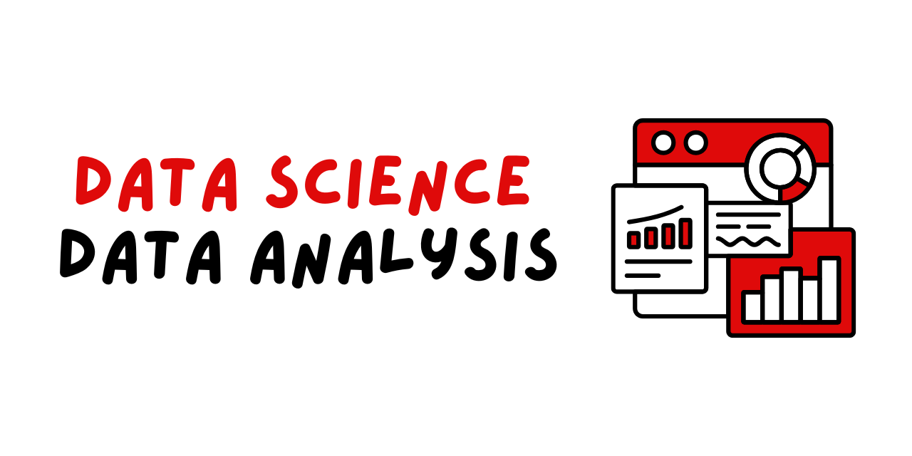

# Data Science Analysis
Welcome to the MSOE Data Science Repository! This is a collection of my work ranging from Week 1 to Week 7. In this repository, I explore all data science 
concepts ranging from data cleaning to performing statistical exploratory data analysis. Each directory covers a concept listed as follows:

## Week 2 | Data Cleaning
In [Week 2](wk_02\lab\Lab_2_JIC.pdf), I explored the data science process. The process works where we start off with a dataset and explore it to identify any patterns. When we discover
such patterns, we ask questions, and such questions lead us to forming a hypothesis. We use the data to answer the hypothesis and design a experiment.

## Week 3 | Data Visualization
In [Week 3](wk_03\tex\Lab_3_JIC.pdf), I explored different methods of data visualization. I learnt about the which type of graphs are appropriate to use, and that means knowing the 
type of data I'm dealing with, such as whether it is categorical or numerical, and the number of variables I'm using.

## Week 4 | Bootstrapping Process
In [Week 4](wk_04\tex\Lab_4_JIC.pdf), I explored the bootstrapping process, as well as understanding what confidence intervals are. Bootstrapping is done in three steps, where we sample
from the original data with replacement and compute the statisitc. We then sort the result from smallest to largest, and then take the 25th and 975th results
from the sorted list.  

## Week 5 | Statistical Testing
In Week 5, I learnt about the statistical testing process, such the one and two sample t-test, Kruskal-Wallis test, Pearson's & Spearman's Correlation, and
the chi-squared test of independence.

## Week 6 | Family Wise Error
In [Week 6](wk_06\tex\Lab_5_JIC.pdf), I looked more at understanding family-wise error. This means knowing how to calculate the probability of getting at least one false positive. I 
learnt about the different statistical families, such the Bonferroni Correction, alpha-spending, alpha-investing and alpha-debt.

## Week 7 | Statistical Exploratory Data Analysis
In [Week 7](wk_07\lab\Lab_6_JIC.pdf), I learnt about making data cards, which is a number of cards that provides a comprehensive summary of the data sets being used. I also did a lab
that focuses on perfoming the process, which can be found in the `wk_07` directory.

